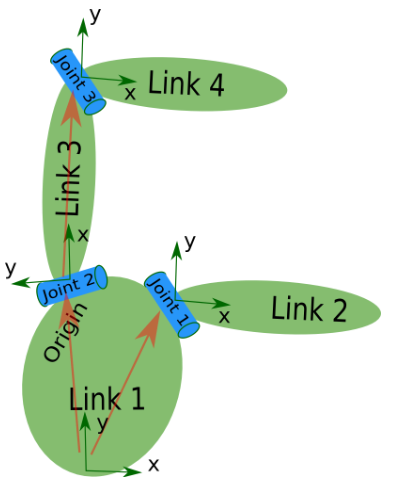
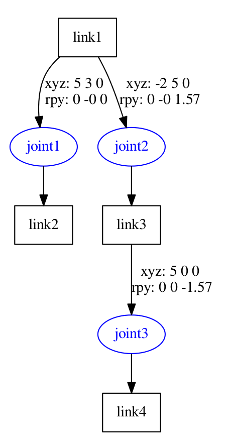

#  Step 1: Create own urdf file

## Create the tree structure
 
```
$ cd ~/catkin_ws/src/
$ catkin_create_pkg my_robot_urdf_tutorial roscpp rospy
$ cd ~/catkin_ws
$ catkin_make
$ cd ~/catkin_ws/src/my_robot_urdf_tutorial
$ mkdir urdf
$ touch urdf/01-first.urdf
```
Copy the below to 01-first.urdf
```
<robot name="test_robot">
  <link name="link1" />
  <link name="link2" />
  <link name="link3" />
  <link name="link4" />

  <joint name="joint1" type="continuous">
    <parent link="link1"/>
    <child link="link2"/>
  </joint>

  <joint name="joint2" type="continuous">
    <parent link="link1"/>
    <child link="link3"/>
  </joint>

  <joint name="joint3" type="continuous">
    <parent link="link3"/>
    <child link="link4"/>
  </joint>
</robot>
```
Next, get this urdf file parsed. There is a simple command line tool that will parse a urdf file for you, and tell you if the syntax is correct.

You might need to install, urdfdom as an upstream, ROS independent package:
```
$ sudo apt-get install liburdfdom-tools
```
Now run the check command:
```
$ cd ~/catkin_ws/src/my_robot_urdf_tutorial/urdf
$ check_urdf 01-first.urdf
```
If everything works correctly, the output should look like this:
```
robot name is: test_robot
---------- Successfully Parsed XML ---------------
root Link: link1 has 2 child(ren)
    child(1):  link2
    child(2):  link3
        child(1):  link4
```

## 2. Add the dimensions
So now that we have the basic tree structure, let's add the appropriate dimensions. As you notice in the robot image, the reference frame of each link (in green) is located at the bottom of the link, and is identical to the reference frame of the joint. So, to add dimensions to our tree, all we have to specify is the offset from a link to the joint(s) of its children. To accomplish this, we will add the field <origin> to each of the joints.

Let's look at the second joint. Joint2 is offset in the Y-direction from link1, a little offset in the negative X-direction from link1, and it is rotated 90 degrees around the Z-axis. So, we need to add the following <origin> element:
```
  <origin xyz="-2 5 0" rpy="0 0 1.57" />
```
If you repeat this for all the elements our URDF will look like this:
```
<robot name="test_robot">
  <link name="link1" />
  <link name="link2" />
  <link name="link3" />
  <link name="link4" />


  <joint name="joint1" type="continuous">
    <parent link="link1"/>
    <child link="link2"/>
    <origin xyz="5 3 0" rpy="0 0 0" />
  </joint>

  <joint name="joint2" type="continuous">
    <parent link="link1"/>
    <child link="link3"/>
    <origin xyz="-2 5 0" rpy="0 0 1.57" />
  </joint>

  <joint name="joint3" type="continuous">
    <parent link="link3"/>
    <child link="link4"/>
    <origin xyz="5 0 0" rpy="0 0 -1.57" />
  </joint>
</robot>
```
Run it through the parser:
```
$ check_urdf 02-dimensions.urdf
```

## 3. Completing the Kinematics
What we didn't specify yet is around which axis the joints rotate. Once we add that, we actually have a full kinematic model of this robot! All we need to do is add the <axis> element to each joint. The axis specifies the rotational axis in the local frame.

So, if you look at joint2, you see it rotates around the positive Y-axis. So, simple add the following xml to the joint element:
```
  <axis xyz="0 1 0" />
```
Similarly, joint1 is rotating around the following axis:
```
  <axis xyz="-0.707 0.707 0" />
```
Note that it is a good idea to normalize the axis.

If we add this to all the joints of the robot, our URDF looks like this:
```
<robot name="test_robot">
  <link name="link1" />
  <link name="link2" />
  <link name="link3" />
  <link name="link4" />

  <joint name="joint1" type="continuous">
    <parent link="link1"/>
    <child link="link2"/>
    <origin xyz="5 3 0" rpy="0 0 0" />
    <axis xyz="-0.9 0.15 0" />
  </joint>

  <joint name="joint2" type="continuous">
    <parent link="link1"/>
    <child link="link3"/>
    <origin xyz="-2 5 0" rpy="0 0 1.57" />
    <axis xyz="-0.707 0.707 0" />
  </joint>

  <joint name="joint3" type="continuous">
    <parent link="link3"/>
    <child link="link4"/>
    <origin xyz="5 0 0" rpy="0 0 -1.57" />
    <axis xyz="0.707 -0.707 0" />
  </joint>
</robot>
```
Run it through the parser
```
$ check_urdf 03-kinematics.urdf
```
That's it, you created your first URDF robot description! Now you can try to visualize the URDF using graphiz:
```
$ urdf_to_graphiz 03-kinematics.urdf 
Created file test_robot.gv
Created file test_robot.pdf
```
and open the generated file with your favorite pdf viewer:
```
$ evince test_robot.pdf
```
 
