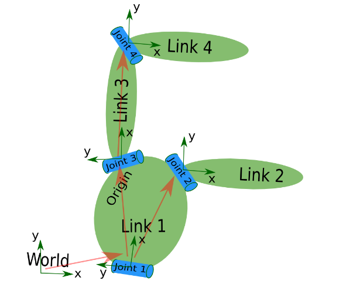

# Step 2: Parse a urdf file

## 1. Reading a URDF File
 
Let's first create a package with a dependency on the urdf parser in our sandbox:
```
$ cd ~/catkin_ws/src
$ catkin_create_pkg my_robot_urdf_tutorial urdf roscpp rospy
$ cd my_robot_urdf_tutorial
```
Now create a /urdf folder to store the urdf file we just created:
```
$ mkdir urdf
$ cd urdf
```
This follows the convention of always storing your robot's URDF file in a ROS package named MYROBOT_description and within a subfolder named /urdf. Other standard subfolders of your robot's description package include /meshes, /media and /cad, like so:
```
/MYROBOT_description
  package.xml
  CMakeLists.txt
  /urdf
  /meshes
  /materials
  /cad
```
Next, copy your urdf files to the package and folder we just created:
```
$ cp /path/to/.../testbot_description/urdf/*.urdf .
```
Create a folder src/ and fire up your editor to create a file called src/parser.cpp:
```
#include <urdf/model.h>
#include "ros/ros.h"

int main(int argc, char** argv){
  ros::init(argc, argv, "my_parser");
  if (argc != 2){
    ROS_ERROR("Need a urdf file as argument");
    return -1;
  }
  std::string urdf_file = argv[1];

  urdf::Model model;
  if (!model.initFile(urdf_file)){
    ROS_ERROR("Failed to parse urdf file");
    return -1;
  }
  ROS_INFO("Successfully parsed urdf file");
  return 0;
}
```
The real action happens in lines 12-13. Here we create a parser object, and initialize it from a file by providing the filename. The initFile method returns true if the URDF file was parsed successfully.

Now let's try to run this code. First add the following lines to your CMakeList.txt file:
```
add_executable(parser src/parser.cpp)
target_link_libraries(parser ${catkin_LIBRARIES})
```
build package, and run it.
```
$ cd ~/catkin_ws
$ catkin_make
$ .<path>/parser <path>03-kinematics.urdf
# Example: $ ./devel/lib/my_robot_urdf_tutorial/parser ./src/my_robot_urdf_tutorial/urdf/03-kinematics.urdf
```
The output should look something like this:
```
[ INFO] [1495013447.905232558]: Successfully parsed urdf file
```

## Reference
* http://docs.ros.org/api/urdf/html/
* A good example of the URDF model class in action is Robot::load() in RViz, in the file src/rviz/robot/robot.cpp.
* https://github.com/ros-visualization/rviz/